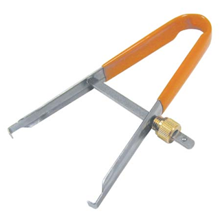
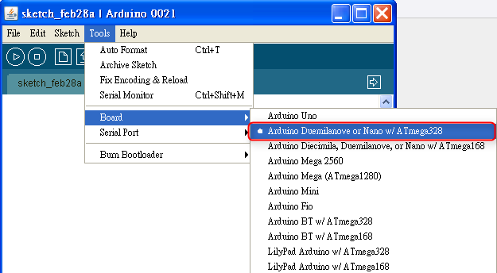
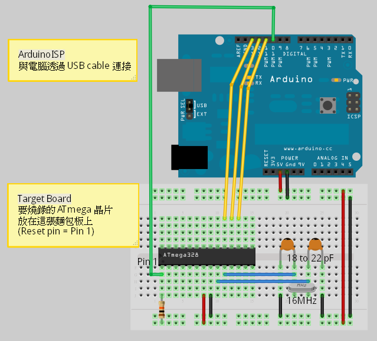
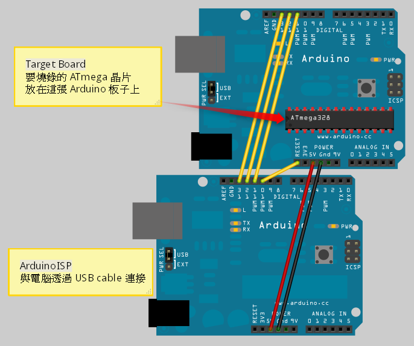

## Arduino入門教學(17) – 如何用 Arduino 燒錄 AVR 晶片 (作者：Cooper Maa)

### 第一部份：用一塊 Arduino 燒錄另一塊 Arduino

這篇教學教你怎麼把 Arduino 板子變成一個 AVR ISP 燒錄器(In-System Programmer)，讓我們把它稱作 ArduinoISP。ArduinoISP 允許你用 Arduino 板子把 bootloader 燒錄到 AVR 晶片上，比如 Arduino 板子上所用的 ATmega168 或 ATmega328 晶片。


什麼是 Bootloader?


一般來說，要開發 AVR 晶片的程式，除了要有一張 AVR 開發板外，還需要準備一個像上圖一樣稱為 AVR ISP(In-System Programmer) 的特殊的裝置，這種裝置的用途主要是讓開發者可以用它把寫好的韌體上傳到晶片上。


什麼是 bootloader 呢？簡單地說，bootloader 是一支程式，晶片上如果有 bootloader，便可以直接把韌體上傳到晶片上，你就不需要 AVR ISP 燒錄裝置了。我們買的 Arduino 板子上的 ATMega 晶片都預先燒錄了 bootloader。市面上也有在賣已經預先燒錄好 Arduino bootloader 的 ATmega 晶片。

平常在用 Arduino IDE 時候，我們既不用準備 AVR ISP，也沒有在 ICSP 介面上接任何連接線，而是直接走 USB 介面就可以上傳程式，之所以可以這麼方便，全都是因為有 bootloader 的關係。

什麼時候需要燒錄 bootloader 呢? 嗯，如果有一天你買了一些材料和全新的 ATmega 晶片，想 DIY 自己做 Arduino 板子的話，那麼就會需要燒錄 bootloader。

#### 材料

* Arduino 板子 x 2
* 單心線 x N
* 全新的 DIP(Dual In-line Package) 包裝 ATmega168 或 ATmega328 晶片

為了方便說明，我們為這兩張 Arduino 板子取個名字，一個是燒錄用的板子，叫作 ArduinoISP，另一個是要被燒錄 bootloader 的板子，稱為 Target board。全新的 ATmega 晶片要放到 Target board 上。

注意：由於 Arduino UNO 目前還未支援，所以你不能把 Arduino UNO 當成 AVR ISP programmer 用。

最好順便準備一個 IC 夾，因為你可能會有需要把 ATmega 晶片從板子上拔起來的時候，使用 IC 夾拔 IC 可以避免接腳受損或折彎。



#### Bootloader 燒錄步驟

1) 首先，使用 USB cable 連接電腦與 ArduinoISP。啟動 Arduino IDE，點 File > Examples > ArduinoISP 並把程式上傳到 ArduinoISP 板子上。


2) 照著底下的接線圖把兩張 Arduino 板子接起來：

兩張板子的 pin 11 ~ pin 13 兩兩對接，pin 11 接 pin 11，pin 12 接 pin 12，pin 13 接 pin 13。
兩張板子的 5V 與 Gnd 也是兩兩對接，5V 接 5V，Gnd 接 Gnd。
最後，ArduinoISP 的 pin 10 接到 Target board 的 Reset pin。


Arduino NG 或更早之前的板子因為沒有 reset pin，接法要稍做調整，必須把 ArduiniISP 的 pin 10 接到 Target board 上的 ATmega 晶片的 pin 1:


3) 從 Arduino IDE 的 Tools > Board  選單中挑選 Target Board 的 ATMega 晶片要燒錄的 bootloader 版本。

假如你買了一顆全新的 ATMega328 晶片，你想拿這顆晶片來製作 Arduino Duemilanove 相容的板子，那麼在這個地方你就要選擇 "Arduino Duemilanove or Nano w/ ATmega328" 這個選項：



4) 點選 Tools > Burn Bootloader > w/ Arduino as ISP 開始燒錄 bootloader。


就這樣，當程式上傳完畢後，就完成了 bootloader 的燒錄工作。你可以試試看在 Target Board 上跑個 Blink 程式，看看晶片的運作是否正常。

底下是 bootloader 燒錄動作摘要：

點 File > Examples > ArduinoISP 並把程式上傳到 ArduinoISP 板子上。
照著接線圖連接兩張 Arduino 板子。
從 Tools > Board  選單中挑選 Target Board 的 ATMega 晶片要燒錄的 bootloader 版本。
點 Tools > Burn Bootloader > w/ Arduino as ISP 開始燒錄 bootloader。

### 第二部份：用一塊 Arduino 燒錄 bootloader 到 AVR 晶片

在第一部份中提到，用 Arduino 做 AVR ISP Programming，我們用了兩張 Arduino 板子，一個是燒錄用的板子，叫作 ArduinoISP，另一個是要被燒錄 bootloader 的板子，稱為 Target board。其實 Target board 不一定非得使用 Arduino 板子不可，你也可以用麵包板當作 Target Board。

#### 用麵包板當作 Target Board 標準版

用麵包板做 Target Board，要準備的材料除了麵包板和 ATmega 晶片外，你還需要 4 個元件：

* 一個 16 MHz 的石英震盪器(Crystal)
* 一個 10k 歐姆電阻，以及
* 兩個 18 到 22 pF(picofarad) 的陶瓷電容

線路接法如下圖： 



#### 用麵包板當作 Target Board 最低需求版

如果你沒有 16 MHz 的石英震盪器也沒有 18-22 pF 的陶瓷電容，那麼你可以設置 ATMega 晶片使用它內部的 8 MHz RC 震盪器當作時脈源。其實 Reset pin 上不放 10K pull up 電阻也沒有關係，所以也可以把它拿掉，這樣你就可以做個最低需求的麵包板 Target Board 了。

線路接法如下圖： 


要用這個最低需求麵包板的 Target Board，你得做一件事。首先打開 C:\arduino-00xx\hardware\arduino\board.txt (00xx 是你 Arduino IDE 的版本號碼)，並將底下這段設定附加到 board.txt 檔案中:

```
##############################################################

atmega328bb.name=ATmega328 on a breadboard (8 MHz internal clock)

atmega328bb.upload.protocol=stk500
atmega328bb.upload.maximum_size=30720
atmega328bb.upload.speed=57600

atmega328bb.bootloader.low_fuses=0xE2
atmega328bb.bootloader.high_fuses=0xD9
atmega328bb.bootloader.extended_fuses=0x07
atmega328bb.bootloader.path=arduino:atmega
atmega328bb.bootloader.file=ATmegaBOOT_168_pro_8MHz.hex
atmega328bb.bootloader.unlock_bits=0x3F
atmega328bb.bootloader.lock_bits=0x0F

atmega328bb.build.mcu=atmega328p
atmega328bb.build.f_cpu=8000000L
atmega328bb.build.core=arduino:arduino
```

接著重新啟動 Arduino IDE，在 Tools > Board  選單中應該就會看到多了一個 "ATmega328 on a breadboard (8 MHz internal clock)" 的選項:


當你設定完成之後，就可以照前一篇的「Bootloader 燒錄步驟」把 bootloader 燒錄到 ATmega 晶片。在燒錄 bootloader 的時候，記得一定要選 "ATmega328 on a breadboard (8 MHz internal clock)" 這個選項，不然的話就沒效。

#### ATmega328 Pinout

下圖是 ATmega328 晶片的腳位排列圖(Pinout)，在連接線路的時候可作為參考:


#### 後記

這篇取材自 "From Arduino to a Microcontroller on a Breadboard" 一文，我做過實驗，標準版可以動(加了 16 MHz 石英震盪器的版本)，但最低需求版的實驗沒有成功(使用內部 RC 震盪器)，在點 Tools > Burn Bootloader > w/ Arduino as ISP 開始燒錄 bootloader 的時候，Arduino IDE 會丟出一個錯誤訊息: "avrdue: Yikes! Invalid device signature.":


不曉得我哪邊的設定不正確? 我大膽猜測可能是 Fuses 的設定不對，不過 AVR Fues 要怎麼設我不懂，如果有網友試驗成功，還請不吝分享

### 第三部份：用一塊 Arduino 燒錄程式到 AVR 晶片

在前兩個部分中，我們介紹了 ArduinoISP 而且使用 ArduinoISP 燒錄 bootloader。這次要介紹的是用 ArduinoISP 來燒錄 Arduino 程式(Arduino Sketch)。這種做法是直接把 Arduino Sketch 燒錄到板子上，沒有用到 bootloader，這讓你得以使用 ATmega 晶片全部的程式空間(program space)。所以，原本 ATmega328 的 32 KB 之中有 2 KB 被 bootloader 拿去使用，現在你將可以完整使用這 32 KB 的空間而不再是 30 KB，ATmega168 將是 16 KB 而不再是 14 KB，而 ATmega8 則是 8 KB 而不再是 7 KB。另外，當板子重啟電源時，原本會有 bootloader 的開機延遲 (約 6 至 8 秒)，這問題現在也一併避掉了。

#### 使用 ArduinoISP 燒錄 Arduino Sketch

1) 首先，先關掉 Arduino IDE

2) 編輯 Arduino 的 preferences.txt

preferences.txt 可以在這個資料夾中找到:

```
Mac: /Users/<USERNAME>/Library/Arduino/preferences.txt

Windows: C:\Documents and Settings\<USERNAME>\Application Data\Arduino\preferences.txt

Linux: ~/.arduino/preferences.txt
```

把 upload.using=bootloader 這行改成 upload.using=arduinoisp。

你也可以用其它 ISP，例如 AVR ISP, AVRISP mkII, USBtinyISP 或 Parallel Programmer，這些 ISP 的識別名稱可以在 hardware/programmer.txt 中找到，例如 avrispmkii。

如果只是某張特定的板子需要用 ISP，那麼你可以編輯 hardware\boards.txt，把 `<BOARDNAME>.upload.using=<ISPNAME>` 這行加到 boards.txt 中。

3) 照底下的接線圖把 ArduinoISP 跟 Target Board 連接起來。記得要供電給 Target Board。

4) 接著按照正常的程序，選擇所用的 Arduino 板子，然後按工具列的 Upload 鈕或選單的『File > Upload to I/O board』把 Arduino Sketch 上傳到板子上。



#### 回到正常的 USB/serial 上傳模式

當你不再使用 ISP 燒錄程式時，記得要切換回正常的 USB/serial 上傳模式。你必須把 preferences.txt 的 upload.using 參數還原為 bootloader:

upload.using=bootloader

或是從 boards.txt 中把 `<BOARDNAME>.upload.using=<ISPNAME>` 這行刪除掉。

記得還得把 bootloader 給燒回 Arduino 板子上。

#### 延伸閱讀

* [Burning sketches to the Arduino board with an external programmer]()

【本文作者為馬萬圳，原文分三篇，網址為： 1. <http://coopermaa2nd.blogspot.tw/2011/03/arduino-avr-ispin-system-programmer-1.html> , 2.  <http://coopermaa2nd.blogspot.tw/2011/03/arduino-avr-ispin-system-programmer-2.html>, 3. 
<http://coopermaa2nd.blogspot.tw/2011/05/arduino-avr-ispin-system-programmer-3.html> ，由陳鍾誠編輯後納入本雜誌】
