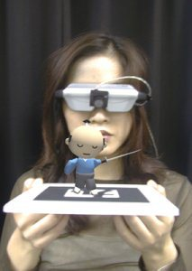
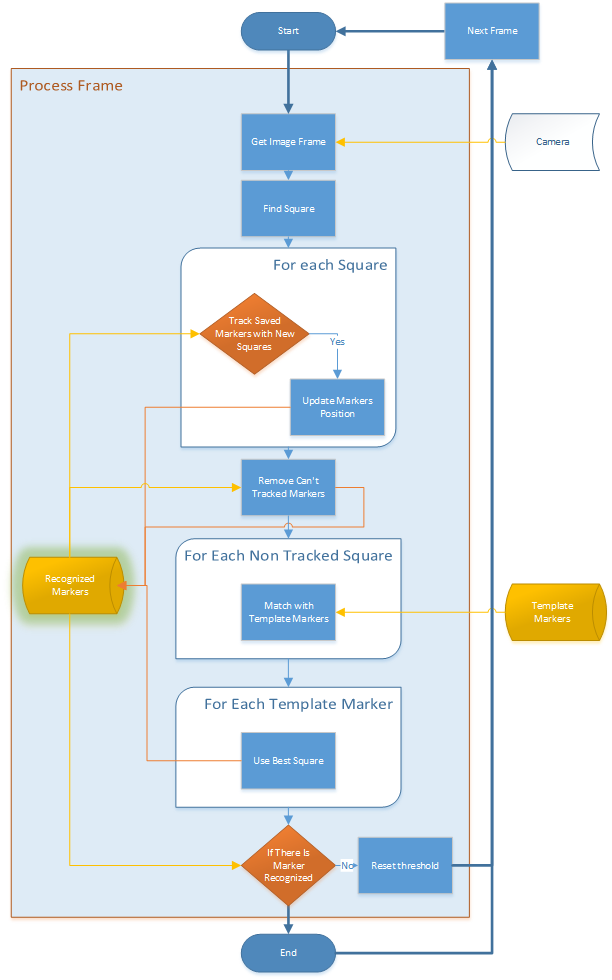
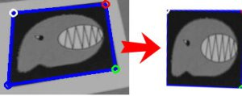

## 使用 OpenCV 實作 AR -- 概念篇 (作者： Heresy Ku )

擴增實境（Augmented Reality，簡稱 AR、 [維基百科](http://zh.wikipedia.org/wiki/%E6%93%B4%E5%A2%9E%E5%AF%A6%E5%A2%83) ）這個技術，主要的概念就是把攝影機實際拍到的畫面，在顯示出來的同時，根據畫面的內容，加上其他的資訊、畫面，讓虛擬的物體，可以和真實的廠景融合在一起顯示。

由於把虛擬和現實融合，算是一個相當有趣、而且也相當特別的應用，所以其實在這方面的應用、研究，也都算滿多的；再加上現在許多行動手持裝置，不但配備了小型化的攝影機，也都有足夠的計算能力了，所以在近年來，也算是越來越熱門。不過實際上，這種概念並不算非常地新，在 1994 年就已經有人提出來了～到目前為止，也算是發展好一段時間了。

而雖然 AR 的理想，是可以直接辨識畫面的內容，來做物體的辨識、定位，但是礙於實際上的計算效率、準確性，現階段比較普遍的應用，應該都還是需要特殊哪片、也就是需要「mark」來做辨識、定位的 AR。像上圖，就是一套算是相當成熟的 AR 開放原始碼函式庫、ARToolkit（ [官網](http://www.hitl.washington.edu/artoolkit/) 、 [維基百科](http://en.wikipedia.org/wiki/ARToolKit) ）的示意圖；裡面的人所拿著的，就是專門的 AR 卡片，上面就是即時辨識出這張卡片，並把虛擬人物放進去的效果。

不過，雖然說 ARToolKit 是一個相當成熟的函式庫，但是由於他已經沒有在繼續維護了（News 最後是 2007 年底、提供的 Windows 環境也是到 Visual Studio .Net 2003 而已），所以以現在的觀點來看，在使用上算是有相當地限制…像是他雖然是以 OpenGL 來做 3D 繪圖的函式庫，但是如果要和新的 Shader-based OpenGL 來做整合，似乎也有不少問題。所以當 Heresy 這邊要做 AR 相關的應用的時候，馬上就覺得他並不適和 Heresy 這邊的需求。

而 Heresy 後來使用的，則是使用以 OpenCV（ [官網](http://opencv.org/) ）這套電腦視覺函式庫所提供的功能為基礎的方法；實作上，主要則是參考 OpenCV-AR（ [首頁](http://opencv-ar.sourceforge.net/) ）這個 SourceForge 上的開放原始碼專案，來修改而實作完成的。

在這個函式庫的實作裡面，他主要概念，是去偵測畫面中的四邊形、然後把抓到的四邊形影像，轉換成為正方形的圖片，根據指定的樣板進行辨識；如果辨識的相似度夠高，則就視為是要處理的 marker，根據四邊形的四個點來計算出所應對應的矩陣，讓顯示的程式可以透過這個矩陣，來把 3D 的物體畫在對應的位置上。

而由於他是基於四邊形偵測來做處理的，而且辨識的過程又是把影像轉換成正方形，所以它基本上能接受的 marker，就變成一定是要是有明確的四邊形外框的正方形影像了～下面兩張圖，就是這個函式庫所給的兩個範例的 marker：

上面兩張圖，基本上是 OpenCV AR 能接受的兩種不同形式的 marker。
左邊的圖基本上是一種比較簡單的形式。他基本上是放大過的圖，原圖大小應該要是 10×10 個像素，每個像素都只有黑或白兩種可能；而由於實際上為了確保外圍的邊還是四邊形，所以外面是不能有白色的；也就是資訊都會記錄在裡面的 8×8、共有 64 個像素的矩形裡。（大小可以透過修改程式來調整）
右邊的則是一個黑底、再加上一般圖片，基本上只要確定黑底在外圍可以構成完整的四邊形、同時影像是方形的，就可以了～而雖然他是給彩色的圖片，不過為了減少環境光造成的影響、同時也減低計算量，所以實際上在內部處理的時候，都是轉換成灰階來做計算的。圖片的大小在程式中並沒有做額外的限制，但是由於圖片越大計算量會越多，所以建議不要用太大的圖檔當作 marker。

前者基本上比較單純，在程式裡面會轉換成編碼過的資料，直接進行比對；基本上不但效率比較好、準確性也比較高；但是相對的，可以變化的幅度就比較小了。

下方是在進行每一個畫面處理時，比較完整的流程圖：

首先，右邊的「Template Markers」是在初始化階段，讀取進來的 marker 的資料，是用來做比對用的樣板（以下稱為 template marker）。而左邊的「Recognized Markers」則是用來記錄成功辨識到的 marker、以及其相對的位置資訊；這個資料在完成後並不會被清除，而是留給外部做存取、以及給下一個畫面做追蹤用的。

在開始後，他會從攝影機取得當下的畫面，做一些處理後，就開始在畫面中偵測四邊形、也就是上圖中「Find Square」的區塊。而在找到畫面中的四邊形後，針對每一個找到的四邊形，會去和之前找到的 marker（Recognized Markers）做比對，如果夠接近的話，就當作是同一個 Marker，然後直接更新它的位置；這基本上算是用追蹤位置的方法，來簡化整個流程的計算量。
而在做完這個動作後，則是會把其他沒有更新過的 Marker 從記錄中刪除，讓 Recognized Markers 裡面只保存在這個畫面，已經追蹤到的 marker。

接下來，則是針對剩下來、沒辦法用 track 來解決的四邊形、則是會把它轉換成正方形的影像後，針對 template markers 裡的所有樣板資料，一筆一筆去做比對，藉此來找出這個四邊形最像的 template marker；這也是整個流程裡面，計算量最大的地方。

上圖就是這邊的示意圖，左邊的藍色框框，就是找到的四邊形，而強制把他轉換成正方形的影像後，就會像右邊的圖一樣；之後就是透過這個轉換後的影像，來進行比對的。而針對不同類型的 marker，其實也有不同的比對方法，這個就等之後講到這部分再來說了～
而這樣找出來的結果，可能會有不同的四邊形，都對應到同一個 template marker；而為了避免這樣的問題，這裡則會再去針對每一個 template marker、都去做一次比較，來找出相似度最高的四變形，並以此為最終的結果，存入 Recognized Markers 中。
如果找完後，完全沒有找到四邊形的話，他會去修改進行 binary threshold 時的 threshold 值（他是用亂數產生），來試著讓程式可以在下一個畫面，找到更多四邊形進行測試。
最後，下面就是最後結果的示意圖。左邊是用來偵錯的畫面，裡面的藍色和紅色框框，就是有偵測到的四邊形；由於只是在偵測四邊形，所以可以看到，裡面的手指間，也被認為是一個四邊形了～=而其中藍色是代表有偵測到，但是沒有找到對應的 template marker，而紅色則是有找到對應的，所以可以看到在右邊的結果畫面裡，「Tw」這個 Maker 已經被一個台灣的 3D 物件取代了～

 
這篇基本上是概念和架構性的文章，大概就先到這邊了。之後有時間，再來寫實作的內容介紹吧～

【本文來自 Heresy's Space 的網誌，原文網址為： <http://kheresy.wordpress.com/2012/12/27/ar-by-opencv/> ，由 Heresy 捐出網誌給程式人雜誌，經陳鍾誠編輯後納入雜誌】
