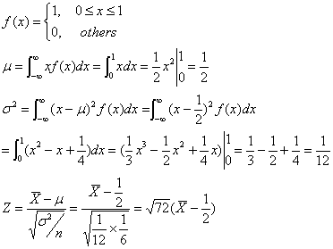

## 亂數產生器 (作者：Bridan)

想過電腦中亂數產生器如何設計的嗎？

大多數亂數產生器採用 [線性同餘法](http://zh.wikipedia.org/w/index.php?title=%E7%B7%9A%E6%80%A7%E5%90%8C%E9%A4%98%E6%96%B9%E6%B3%95&variant=zh-tw) 設計 ( [Linear Congruential Generator, LCG](http://en.wikipedia.org/wiki/Linear_congruential_generator) )，因為方法簡單以及亂數 [均勻分佈](http://zh.wikipedia.org/w/index.php?title=%E5%9D%87%E5%8B%BB%E5%88%86%E4%BD%88&variant=zh-tw)  ( [Uniform distribution](http://en.wikipedia.org/wiki/Uniform_distribution) )。

其原理為：

```
Xn = a Xn-1 + b     將一正整數乘以 a 常數再加上 b 常數，
0<= Xn＜M           除 M 取餘數，這個 Xn 可重複代入上式計算下一個亂數。
```

各位可以參考 [EXCEL 檔](https://docs.google.com/spreadsheet/ccc?key=0AvTFWEwZaQ8_dGpvOW96a3kySlh1cWwxeG04QkV2N0E&hl=zh_TW#gid=0) ，我選用 a = 49，b = 0，M = 215 = 32768，C 欄位就是亂數，介於零與一之間，從 E、F 欄位可以看出數值分部非常均勻。
另外，從 A 欄位會發現，每 2048 筆資料會重複循環，這裡所舉的例子是方便讀者明瞭原理，商用軟體至少用32 bits，並挑選合適的 a b 值，所以很難發現重複性。

通常均勻分佈的亂數產生器就夠用，不過與統計有關的程式還需要 [常態分佈](http://zh.wikipedia.org/w/index.php?title=%E5%B8%B8%E6%85%8B%E5%88%86%E4%BD%88&variant=zh-tw) ( [Normal distribution](http://en.wikipedia.org/wiki/Normal_distribution) ) 的亂數產生器，那如何設計呢？還記得 [中央極限定理](http://zh.wikipedia.org/w/index.php?title=%E4%B8%AD%E5%BF%83%E6%9E%81%E9%99%90%E5%AE%9A%E7%90%86&variant=zh-tw) ( [Central limit theorem](http://en.wikipedia.org/wiki/Central_limit_theorem) ) 吧！從未知分佈的母群體中抽樣，只要能計算出這群體平均數 μ 以及有限的變異數 σ2，那麼抽出 n 個隨機樣本取平均值，當 n 趨近無窮大，它的平均值抽樣分配將近似於常態分佈。再以 EXCEL 檔內容為例，一般程式計算時間有限不可能無窮計算下去，因此 **只取連續六筆資料平均再正規化** ，原均勻分佈的 C 欄位值，經過計算後就成為 H 欄位常態分佈的亂數，請參考 J 欄位的機率分佈。



另外，常態分佈亂數方法二，請參考 <http://4rdp.blogspot.com/2008/06/random-variable-of-normal-distribution.html> 。

(本文來自「研發養成所」 Bridan 的網誌，原文網址為 <http://4rdp.blogspot.tw/2008/06/blog-post_14.html> ，由陳鍾誠編輯後納入程式人雜誌)

