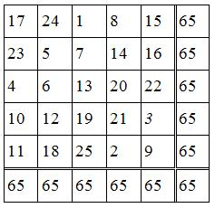
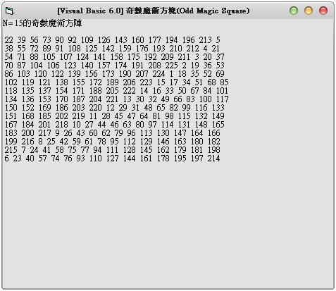

## Visual Basic 6.0：奇數魔術方陣(Odd Magic Square) 詳細解法 (作者：廖憲得 0xde)

什麼是奇數魔術方陣 (?)

> 魔術方陣是許多人想要解決的一個古老的數學問題，您可能在一些雜誌上看過，也可能您的老師有介紹過。一個魔術方陣是在於安排數字在一矩陣[n x n]中，從1到n2, 每一數字僅出現一次, 而且，任一列、任一行或任一對角線的總和都相同。求總和的公式要證明為n [ ( n2 + 1) / 2 ]，並不是很困難，若我們利用這個公式，對[5x5]矩陣而言，其總和為5 [ ( 52 + 1 ) / 2 ] = 65，其對應的魔術方陣輸出如下：




 
```monobasic
'# [Visual Basic 6.0] 奇數魔術方陣(Odd Magic Square)
'# 0xDe
Dim InputN
Dim Squate()
Private Sub Form_Activate()
'------------------------------
InputN = 3 ' 輸入 (必須為奇數)
'------------------------------


'------------------------------
If InputN Mod 2 = 0 Then Exit Sub ' 判斷是否為奇數
'------------------------------
ReDim Square(InputN - 1, InputN - 1)
'------------------------------
Print "N= " & InputN & "的奇數魔術方陣" & vbCrLf
Randomize Timer ' 亂數產生
TempX = Int(Rnd * InputN) ' 隨機起始 X
TempY = Int(Rnd * InputN) ' 隨機起始 Y
'------------------------------
Do Until N = (InputN ^ 2) ' 直到放滿
    If Square(TempX, TempY) = "" Then
        N = N + 1
        Square(TempX, TempY) = N
        
        TempX = TempX - 1 ' 向上移
        If TempX < 0 Then TempX = InputN - 1
        TempY = TempY + 1 ' 向右移
        If TempY > InputN - 1 Then TempY = 0
    Else
        ' 恢復原本的狀態往下
        TempX = TempX + 1
        If TempX > InputN - 1 Then TempX = 0
        TempY = TempY - 1
        If TempY < 0 Then TempY = InputN - 1
        ' 往下
        TempX = TempX + 1
        If TempX > InputN - 1 Then TempX = 0
    End If
Loop
'------------------------------
    For I = 0 To InputN - 1 ' 將結果輸出
        For J = 0 To InputN - 1
            Print Square(I, J);
        Next J
            Print
    Next I
'------------------------------
End Sub
```
 
* 原始碼下載： [Visual Basic 6.0:奇數魔術方陣(Odd Magic Square).rar](http://files.dotblogs.com.tw/0xde/1311/20131113153918434.rar)

【本文作者為「廖憲得」，原文網址為： <http://www.dotblogs.com.tw/0xde/archive/2013/11/13/129187.aspx> ，由陳鍾誠編輯後納入本雜誌】
